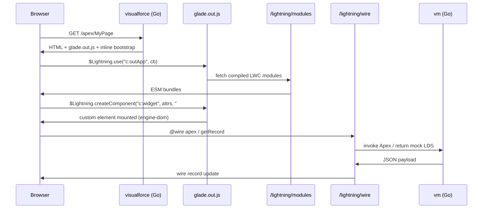

# Lightning Out on Visualforce + Interactive LWC Runtime

> **For agentic workers:** REQUIRED SUB-SKILL: Use superpowers:subagent-driven-development (recommended) or superpowers:executing-plans to implement this plan task-by-task. Steps use checkbox (`- [ ]`) syntax for tracking.

**Goal:** Make Lightning Out work on locally rendered Visualforce pages in Glade, with a browser-based interactive LWC runtime (reactivity, events, shadow DOM, real `@wire`, `@salesforce/*` modules), optional SSR server routes, and full integration with `glade dev vf` and `GET /apex/*`.

**Architecture:** VF continues server-side HTML rendering in Go (`internal/visualforce`). `<apex:includeLightning />` injects a Glade-hosted `$Lightning` shim and module loader instead of Salesforce `lightning.out.js`. The shim boots compiled LWC bundles (`@lwc/compiler` output) in the browser via `@lwc/engine-dom`. Aura `ltng:outApp` dependency apps are indexed in Go to resolve `$Lightning.use("c:app")` → component allowlist. `@wire` and `@salesforce/apex` call back into Glade HTTP endpoints that execute Apex on the existing VM. SSR routes (`GET /lightning/cmp/...`) use `@lwc/engine-server` in a Node sidecar (preferred over v8go for LWC compatibility); v8go remains a fallback spike only.

**Tech Stack:** Go 1.26, `golang.org/x/net/html`, existing `internal/visualforce`, `internal/lwc`, `internal/uicontroller`, `internal/server`, `internal/vm`; MIT npm packages `lwc@9.x`, `@lwc/compiler`, `@lwc/engine-dom`, `@lwc/engine-server`, `@lwc/synthetic-shadow`; Node 20+ sidecar for compile/SSR; SLDS via CDN (same as `<apex:slds />`).

**Prerequisites:** Phase 1 static LWC renderer shipped (`docs/superpowers/plans/2026-06-10-lwc-rendering.md`).

**Research:** `docs/research/lwc-rendering-methodology.md` (sections 3, 4, 7, 9, 10).

---

## Scope

### In scope

| Area | Deliverable |
|------|-------------|
| Aura Out apps | Index `extends="ltng:outApp"` apps and `aura:dependency` LWC refs |
| VF Lightning Out | Replace notice banner; emit shim + bootstrap scripts |
| `$Lightning` API | `use()`, `createComponent()` compatible subset |
| LWC compilation | Compile project bundles to ESM served by dev server |
| Browser runtime | `@lwc/engine-dom`, shadow DOM, scoped CSS, reactivity, lifecycle |
| Events | DOM `CustomEvent` with `bubbles` + `composed` |
| `@salesforce/*` | label, schema, resourceUrl, user/i18n stubs, apex |
| Real `@wire` | Apex wire + mock adapters (`getRecord` stub phase 1) |
| Server routes | `/lightning/modules/*`, `/lightning/wire/*`, `/lightning/cmp/*` |
| Dev integration | `glade dev vf` hot-reload includes LWC + aura app changes |
| Tests | Unit, HTTP, and browser fixture for VF + LWC mount |

### Out of scope

| Area | Reason |
|------|--------|
| Salesforce-hosted `lightning.out.js` | Requires live org CDN + session |
| Lightning Out 2.0 iframe model | External embedding, not VF |
| Lightning Locker / LWS membrane | Enormous; defer until base runtime stable |
| Full `lightning-base-components` npm parity | Package unavailable; keep stubs + expand incrementally |
| Aura component rendering engine | Only index out apps for dependency resolution |
| `lwc:dom` manual DOM | Security + complexity; explicit unsupported surface |

---

## Architecture



### Runtime boundary decision

| Surface | Runtime | Rationale |
|---------|---------|-----------|
| VF Lightning Out (browser) | `@lwc/engine-dom` in browser | Matches Salesforce; VF is already HTML to a browser |
| `glade render lwc` (CLI) | Keep static Go renderer | Fast snapshots; no JS required |
| `GET /lightning/cmp/...` (SSR) | Node + `@lwc/engine-server` | Official SSR path; avoids v8go DOM gaps |
| Apex / wire back end | Go `internal/vm` | Reuse existing Apex execution |

**v8go spike (Task 2b):** Time-boxed evaluation only. Do not block VF Lightning Out on v8go.

---

## File Structure

| File | Action | Role |
|------|--------|------|
| `internal/aura/outapp.go` | Create | Parse `ltng:outApp` Aura apps and dependencies |
| `internal/aura/outapp_test.go` | Create | Out app indexing tests |
| `internal/aura/index.go` | Create | `Index`, `Build(project, typesys)` |
| `internal/lightningout/shim.go` | Create | Go-side bootstrap HTML/JSON config for `$Lightning` |
| `internal/lightningout/parse.go` | Create | Extract `$Lightning.use/createComponent` from VF scripts |
| `internal/lightningout/parse_test.go` | Create | Script parser tests |
| `internal/lwc/compile/` | Create | Go wrapper invoking Node compile script |
| `scripts/lwc-compile.mjs` | Create | `@lwc/compiler` batch compile to `dist/lwc/` |
| `scripts/lwc-ssr.mjs` | Create | `@lwc/engine-server` SSR entry for sidecar |
| `third_party/lwc/package.json` | Create | Pinned `lwc@9.3.4` dependencies |
| `internal/lwcbrowser/manifest.go` | Create | Module manifest (bundle → compiled URL) |
| `internal/lwcbrowser/wire.go` | Create | Wire adapter registry (Go side) |
| `internal/lwcbrowser/wire_adapters.go` | Create | Apex, label, schema, getRecord stubs |
| `internal/lwcbrowser/salesforce_modules.go` | Create | Map `@salesforce/*` imports to shim modules |
| `internal/lwcruntime/embed/` | Create | `glade.out.js` built artifact (esbuild output) |
| `lwcruntime/src/glade.out.ts` | Create | `$Lightning` shim source |
| `lwcruntime/src/module-map.ts` | Create | Browser resolver for project + salesforce shims |
| `lwcruntime/src/wire-client.ts` | Create | Fetch wire updates from `/lightning/wire` |
| `lwcruntime/esbuild.config.mjs` | Create | Bundle shim for embed |
| `internal/server/lightning.go` | Create | `/lightning/modules`, `/lightning/wire`, `/lightning/cmp` |
| `internal/server/lightning_test.go` | Create | HTTP tests for lightning routes |
| `internal/visualforce/render.go` | Modify | Real `includeLightning` output |
| `internal/visualforce/page.go` | Modify | Pass `LightningOutConfig` into render |
| `internal/gladecli/dev_vf_command.go` | Modify | Watch LWC/aura; precompile on reload |
| `internal/project/project.go` | Modify | Ensure aura `.app` files indexed (already via `AuraFiles`) |
| `testdata/local-tests/lightning-out-vf/` | Create | VF page + out app + LWC fixture |
| `internal/lightningout/integration_test.go` | Create | HTTP + HTML contains bootstrap |

---

## Phase 1: Aura Lightning Out App Index

### Task 1: Parse `ltng:outApp` dependency apps

**Files:**
- Create: `internal/aura/outapp.go`, `internal/aura/outapp_test.go`, `internal/aura/index.go`

- [ ] **Step 1: Write failing test**

```go
func TestParseOutAppDependencies(t *testing.T) {
	source := `<aura:application access="GLOBAL" extends="ltng:outApp">
    <aura:dependency resource="c:myWidget"/>
    <aura:dependency resource="c:anotherWidget"/>
</aura:application>`
	app, err := ParseOutApp("lightningOut", source)
	if err != nil {
		t.Fatal(err)
	}
	if app.Extends != "ltng:outApp" {
		t.Fatalf("extends = %q", app.Extends)
	}
	if len(app.Dependencies) != 2 || app.Dependencies[0] != "c:myWidget" {
		t.Fatalf("deps = %#v", app.Dependencies)
	}
}
```

- [ ] **Step 2: Run test — expect FAIL**

```bash
go test ./internal/aura -run TestParseOutAppDependencies -count=1
```

- [ ] **Step 3: Implement `outapp.go`**

```go
package aura

import "regexp"

var (
	outAppExtendsRE   = regexp.MustCompile(`(?i)\bextends\s*=\s*["']ltng:outApp["']`)
	dependencyAttrRE  = regexp.MustCompile(`(?i)<aura:dependency[^>]*\bresource\s*=\s*["']([^"']+)["']`)
)

type OutApp struct {
	Name         string
	Extends      string
	Dependencies []string // e.g. c:myWidget
}

func ParseOutApp(name, source string) (OutApp, error) {
	app := OutApp{Name: name}
	if !outAppExtendsRE.MatchString(source) {
		return OutApp{}, fmt.Errorf("%q is not a Lightning Out app", name)
	}
	app.Extends = "ltng:outApp"
	for _, m := range dependencyAttrRE.FindAllStringSubmatch(source, -1) {
		app.Dependencies = append(app.Dependencies, m[1])
	}
	return app, nil
}
```

- [ ] **Step 4: Implement `index.go`**

```go
func BuildIndex(p project.Project) (Index, error) {
	var apps []OutApp
	for _, group := range groupAuraApps(p.AuraFiles) {
		// read .app file, ParseOutApp when extends ltng:outApp
	}
	return Index{OutApps: apps}, nil
}

func (idx Index) OutApp(qualified string) (OutApp, bool) {
	// qualified: "c:lightningOut" or "pkg:lightningOut"
}
```

- [ ] **Step 5: Run tests — expect PASS**

```bash
go test ./internal/aura -count=1
```

- [ ] **Step 6: Commit**

```bash
git add internal/aura
git commit -m "feat(aura): index ltng:outApp dependency applications"
```

---

### Task 2: Parse `$Lightning` calls from VF scripts

**Files:**
- Create: `internal/lightningout/parse.go`, `internal/lightningout/parse_test.go`

- [ ] **Step 1: Write failing test**

```go
func TestParseLightningUseAndCreateComponent(t *testing.T) {
	script := `$Lightning.use("c:lightningOut", function() {
		$Lightning.createComponent("c:myWidget", { recordId: "001" }, "host", function(cmp) {});
	});`
	calls, err := ParseLightningCalls(script)
	if err != nil {
		t.Fatal(err)
	}
	if len(calls.Use) != 1 || calls.Use[0].App != "c:lightningOut" {
		t.Fatalf("use = %#v", calls.Use)
	}
	if len(calls.Create) != 1 || calls.Create[0].Component != "c:myWidget" {
		t.Fatalf("create = %#v", calls.Create)
	}
}
```

- [ ] **Step 2: Run test — expect FAIL**

```bash
go test ./internal/lightningout -run TestParseLightningUseAndCreateComponent -count=1
```

- [ ] **Step 3: Implement regex parser**

```go
package lightningout

type UseCall struct {
	App string
}

type CreateCall struct {
	Component string
	Locator   string // element id or selector
}

type Calls struct {
	Use    []UseCall
	Create []CreateCall
}

var (
	lightningUseRE    = regexp.MustCompile(`\$Lightning\.use\s*\(\s*["']([^"']+)["']`)
	createComponentRE = regexp.MustCompile(`\$Lightning\.createComponent\s*\(\s*["']([^"']+)["']\s*,\s*(\{[^}]*\}|[^,]+)\s*,\s*["']([^"']+)["']`)
)
```

- [ ] **Step 4: Run tests — expect PASS**

```bash
go test ./internal/lightningout -count=1
```

- [ ] **Step 5: Commit**

```bash
git add internal/lightningout
git commit -m "feat(lightningout): parse Lightning.use and createComponent from vf scripts"
```

---

## Phase 2: LWC Compilation Pipeline

### Task 3: Node compile script and Go wrapper

**Files:**
- Create: `third_party/lwc/package.json`, `scripts/lwc-compile.mjs`, `internal/lwc/compile/compile.go`, `internal/lwc/compile/compile_test.go`

- [ ] **Step 1: Add pinned npm manifest**

`third_party/lwc/package.json`:

```json
{
  "name": "glade-lwc-toolchain",
  "private": true,
  "dependencies": {
    "lwc": "9.3.4",
    "@lwc/compiler": "9.3.4",
    "@lwc/engine-dom": "9.3.4",
    "@lwc/engine-server": "9.3.4",
    "@lwc/synthetic-shadow": "9.3.4"
  }
}
```

- [ ] **Step 2: Write compile script**

`scripts/lwc-compile.mjs` reads JSON stdin `{ "modulesDir": "...", "outDir": "...", "namespace": "c" }`, walks `lwc/*/` bundles, compiles each with `@lwc/compiler`, writes ESM to `outDir`.

- [ ] **Step 3: Write failing Go test**

```go
func TestCompileProjectLWCBundles(t *testing.T) {
	root := filepath.Join("..", "..", "testdata", "local-tests", "lwc-rendering")
	out := filepath.Join(t.TempDir(), "dist")
	p, err := project.Load(root)
	if err != nil {
		t.Fatal(err)
	}
	manifest, err := compile.Compile(p, compile.Options{OutDir: out, Namespace: "c"})
	if err != nil {
		t.Fatal(err)
	}
	if len(manifest.Modules) == 0 {
		t.Fatal("expected compiled modules")
	}
}
```

- [ ] **Step 4: Implement `compile.go`**

```go
package compile

type Manifest struct {
	Modules map[string]ModuleEntry // "c/counter" -> { File, TagName }
}

func Compile(p project.Project, opts Options) (Manifest, error) {
	// exec: node scripts/lwc-compile.mjs < config.json
}
```

- [ ] **Step 5: Run test (requires `npm install` in third_party/lwc)**

```bash
cd third_party/lwc && npm install
go test ./internal/lwc/compile -count=1
```

- [ ] **Step 6: Commit**

```bash
git add third_party/lwc scripts/lwc-compile.mjs internal/lwc/compile
git commit -m "feat(lwc): add node-backed lwc compiler wrapper"
```

---

### Task 4: Module manifest and dev cache

**Files:**
- Create: `internal/lwcbrowser/manifest.go`, `internal/lwcbrowser/manifest_test.go`

- [ ] **Step 1: Write failing test for manifest lookup**

```go
func TestManifestResolveComponentModule(t *testing.T) {
	m := lwcbrowser.Manifest{
		Modules: map[string]lwcbrowser.ModuleEntry{
			"c/myWidget": {URL: "/lightning/modules/c/myWidget.js", Tag: "c-my-widget"},
		},
	}
	entry, ok := m.Resolve("c:myWidget")
	if !ok || entry.Tag != "c-my-widget" {
		t.Fatalf("entry = %#v ok=%v", entry, ok)
	}
}
```

- [ ] **Step 2: Implement manifest with qualified name normalization**

`c:myWidget` → module key `c/myWidget` (namespace/component).

- [ ] **Step 3: Run tests — expect PASS**

```bash
go test ./internal/lwcbrowser -count=1
```

- [ ] **Step 4: Commit**

```bash
git add internal/lwcbrowser
git commit -m "feat(lwcbrowser): add compiled module manifest resolver"
```

---

## Phase 3: Browser `$Lightning` Shim

### Task 5: `glade.out.js` — `use()` and `createComponent()`

**Files:**
- Create: `lwcruntime/src/glade.out.ts`, `lwcruntime/src/module-map.ts`, `lwcruntime/esbuild.config.mjs`
- Create: `internal/lwcruntime/embed/embed.go` (go:embed)

- [ ] **Step 1: Write shim `use()`**

```typescript
// lwcruntime/src/glade.out.ts
type LightningGlobal = {
  use(app: string, callback: () => void, endpoint?: string, token?: string): void;
  createComponent(
    qualified: string,
    attrs: Record<string, unknown>,
    locator: string,
    callback?: (cmp: Element) => void
  ): void;
};

export function installLightning(config: GladeLightningConfig): LightningGlobal {
  return {
    use(app, callback) {
      // validate app against config.outApps[app]
      callback();
    },
    createComponent(qualified, attrs, locator, callback) {
      // dynamic import config.manifest[qualified]
      // customElements.define if needed
      // create element, set attributes, append to #locator
      callback?.(element);
    },
  };
}
```

- [ ] **Step 2: Build with esbuild**

```bash
cd lwcruntime && npm install && node esbuild.config.mjs
```

Output: `internal/lwcruntime/embed/glade.out.js`

- [ ] **Step 3: Go embed helper**

```go
//go:embed glade.out.js
var OutJS []byte

func ScriptTag() string {
  return `<script type="module" src="/lightning/glade.out.js"></script>`
}
```

- [ ] **Step 4: Commit**

```bash
git add lwcruntime internal/lwcruntime
git commit -m "feat(lightningout): add browser Lightning shim with use and createComponent"
```

---

### Task 6: Shadow DOM, scoped CSS, reactivity (engine-dom integration)

**Files:**
- Modify: `lwcruntime/src/glade.out.ts`, `scripts/lwc-compile.mjs`

- [ ] **Step 1: Enable synthetic shadow in compile output**

In `lwc-compile.mjs`, pass compiler option `enableSyntheticShadow: true` (or import `@lwc/synthetic-shadow` before component registration in shim).

- [ ] **Step 2: Write browser fixture test (Playwright-style or jsdom in Node)**

`lwcruntime/test/mount.test.mjs`:

```javascript
import { installLightning } from '../dist/glade.out.js';
// mount counter component, mutate @api property, assert DOM updates
```

- [ ] **Step 3: Verify reactive property update**

Counter component: clicking button increments `{count}` in template.

- [ ] **Step 4: Commit**

```bash
git add lwcruntime scripts/lwc-compile.mjs
git commit -m "feat(lwcruntime): enable engine-dom reactivity and synthetic shadow"
```

---

### Task 7: Event dispatch and handling

**Files:**
- Create: `lwcruntime/src/events.ts`
- Create: `testdata/local-tests/lightning-out-vf/.../eventChild` LWC

- [ ] **Step 1: Fixture child fires `CustomEvent`**

```javascript
// eventChild.js
handleClick() {
  this.dispatchEvent(new CustomEvent('select', { detail: { id: '1' }, bubbles: true, composed: true }));
}
```

- [ ] **Step 2: Test parent listener in VF host page script**

```html
<script>
$Lightning.use("c:outApp", function() {
  $Lightning.createComponent("c:eventChild", {}, "host", function(cmp) {
    cmp.addEventListener("select", function(e) { window.__selected = e.detail.id; });
  });
});
</script>
```

- [ ] **Step 3: Browser test asserts `window.__selected === "1"` after click**

- [ ] **Step 4: Commit**

```bash
git add lwcruntime testdata/local-tests/lightning-out-vf
git commit -m "feat(lwcruntime): support composed custom events from lwc"
```

---

## Phase 4: `@salesforce/*` Modules and Real `@wire`

### Task 8: Salesforce module shims

**Files:**
- Create: `internal/lwcbrowser/salesforce_modules.go`, `lwcruntime/src/salesforce/label.ts`, `schema.ts`, `apex.ts`, `resourceUrl.ts`

- [ ] **Step 1: Go registry maps import specifiers**

```go
var StandardImportPaths = map[string]string{
  "@salesforce/label/c.MyLabel": "/lightning/shims/label/MyLabel",
  "@salesforce/schema/Account.Name": "/lightning/shims/schema/Account.Name",
}
```

- [ ] **Step 2: HTTP handlers return JSON / ES module exports**

`GET /lightning/shims/label/MyLabel` → `export default "Hello";` (resolved from `org.Metadata.Labels`).

- [ ] **Step 3: Test label shim endpoint**

```bash
go test ./internal/server -run TestLightningLabelShim -count=1
```

- [ ] **Step 4: Commit**

```bash
git add internal/lwcbrowser internal/server lwcruntime/src/salesforce
git commit -m "feat(lightning): serve salesforce module shims from org metadata"
```

---

### Task 9: Apex wire adapter (real VM invocation)

**Files:**
- Create: `internal/lwcbrowser/wire.go`, `internal/lwcbrowser/wire_adapters.go`
- Create: `internal/server/lightning_wire.go`
- Create: `lwcruntime/src/wire-client.ts`

- [ ] **Step 1: Write failing wire endpoint test**

```go
func TestLightningWireApexReturnsData(t *testing.T) {
	// POST /lightning/wire/apex { "class": "WidgetCtrl", "method": "getItems", "params": {} }
	// VM has WidgetCtrl.getItems returning List<Map>
	// Response: { "data": [...], "error": null }
}
```

- [ ] **Step 2: Implement Go wire handler**

```go
func (s *Server) handleLightningWire(w http.ResponseWriter, r *http.Request) {
	// decode WireApexRequest
	// machine.InvokeStaticMethod or instance wire method
	// serialize vm.Value → JSON
}
```

- [ ] **Step 3: Browser wire client polls/subscribes**

```typescript
// wire-client.ts
export async function apexWire(className: string, method: string, params: Record<string, unknown>) {
  const res = await fetch('/lightning/wire/apex', { method: 'POST', body: JSON.stringify({ className, method, params }) });
  return res.json();
}
```

- [ ] **Step 4: Compile LWC with `@wire(getItems, { recordId: '$recordId' })` fixture; integration test**

- [ ] **Step 5: Commit**

```bash
git add internal/lwcbrowser internal/server lwcruntime
git commit -m "feat(lightning): real apex wire adapter backed by vm"
```

---

### Task 10: `getRecord` wire stub (LDS phase 1)

**Files:**
- Modify: `internal/lwcbrowser/wire_adapters.go`, `internal/server/lightning_wire.go`

- [ ] **Step 1: Accept `getRecord` wire with `recordId` param**

Return `{ fields: { Name: { value: "Acme" } } }` from org storage when record exists.

- [ ] **Step 2: Test with LWC `wiredRecord` property update in browser fixture**

- [ ] **Step 3: Commit**

```bash
git commit -m "feat(lightning): add getRecord wire stub backed by org storage"
```

---

## Phase 5: Server Routes

### Task 11: `/lightning/modules/*` — serve compiled ESM

**Files:**
- Create: `internal/server/lightning.go`, `internal/server/lightning_test.go`
- Modify: `internal/server/server.go`

- [ ] **Step 1: Write failing HTTP test**

```go
func TestLightningModulesServesCompiledJS(t *testing.T) {
	handler := testServerWithCompiledLWC(t)
	req := httptest.NewRequest(http.MethodGet, "/lightning/modules/c/counter.js", nil)
	rec := httptest.NewRecorder()
	handler.ServeHTTP(rec, req)
	if rec.Code != http.StatusOK {
		t.Fatalf("status = %d", rec.Code)
	}
	if !strings.Contains(rec.Header().Get("Content-Type"), "javascript") {
		t.Fatal("wrong content type")
	}
}
```

- [ ] **Step 2: Route in `server.go`**

```go
if len(parts) >= 2 && parts[0] == "lightning" {
	s.handleLightning(w, r, parts[1:])
	return
}
```

- [ ] **Step 3: Implement module cache (compile on project load; invalidate on watch)**

- [ ] **Step 4: Run tests — expect PASS**

```bash
go test ./internal/server -run TestLightning -count=1
```

- [ ] **Step 5: Commit**

```bash
git add internal/server
git commit -m "feat(server): add lightning module and wire routes"
```

---

### Task 12: `GET /lightning/cmp/{ns}/{name}` — SSR via Node sidecar

**Files:**
- Create: `scripts/lwc-ssr.mjs`, `internal/lwc/ssr/ssr.go`

- [ ] **Step 1: SSR script stdin/stdout protocol**

```json
// stdin
{ "component": "c/counter", "props": { "count": 3 }, "modulesDir": "..." }
// stdout
{ "html": "<c-counter>...</c-counter>", "error": null }
```

- [ ] **Step 2: Go handler**

```go
func (s *Server) handleLightningComponentSSR(w http.ResponseWriter, r *http.Request, parts []string) {
	// parts: cmp, c, counter
	html, err := ssr.Render(s.lwcManifest, qualified, propsFromQuery(r))
	fmt.Fprint(w, html)
}
```

- [ ] **Step 3: Test SSR route returns HTML with shadow content**

- [ ] **Step 4: Commit**

```bash
git add scripts/lwc-ssr.mjs internal/lwc/ssr internal/server
git commit -m "feat(server): add ssr route for lightning components via engine-server"
```

---

### Task 13 (spike): v8go evaluation — document decision

**Files:**
- Create: `docs/research/lwc-v8go-spike.md`

- [ ] **Step 1: Spike script attempts engine-server in v8go**

- [ ] **Step 2: Record gaps (module loader, DOM, fetch)**

- [ ] **Step 3: Confirm Node sidecar as default; close spike**

**Do not implement v8go production path unless spike passes all SSR tests.**

---

## Phase 6: Visualforce Integration

### Task 14: Replace `includeLightning` notice with bootstrap

**Files:**
- Modify: `internal/visualforce/render.go`, `internal/visualforce/page.go`
- Create: `internal/lightningout/shim.go`

- [ ] **Step 1: Update failing `setup_page_test.go`**

Change expectation from `glade-vf-lightning-notice` to `glade.out.js` and `GladeLightningConfig`.

- [ ] **Step 2: Implement `renderApexIncludeLightning`**

```go
func renderApexIncludeLightning(_ *MarkupNode, ctx *RenderContext) (string, error) {
	if ctx != nil {
		ctx.LightningOut = true
	}
	cfg := lightningout.PageConfig{
		OutApps:   ctx.LightningOutApps,
		Manifest:  ctx.LightningManifest,
		Namespace: ctx.Expression.ProjectNamespace,
	}
	return lightningout.BootstrapHTML(cfg), nil
}
```

`BootstrapHTML` returns:

```html
<script type="application/json" id="glade-lightning-config">...</script>
<script type="module" src="/lightning/glade.out.js"></script>
```

- [ ] **Step 3: `RenderPage` builds manifest via `lwcbrowser.CompileIfNeeded`**

- [ ] **Step 4: Run VF tests — expect PASS**

```bash
go test ./internal/visualforce -count=1
```

- [ ] **Step 5: Commit**

```bash
git add internal/visualforce internal/lightningout
git commit -m "feat(visualforce): bootstrap glade lightning out on includeLightning"
```

---

### Task 15: End-to-end VF + Lightning Out fixture

**Files:**
- Create: `testdata/local-tests/lightning-out-vf/`

Layout:

```
force-app/main/default/
  aura/lightningOut/lightningOut.app     # extends ltng:outApp, dependency c:counter
  lwc/counter/                           # interactive counter (from lwc-rendering)
  pages/WidgetHost.page                  # includeLightning + $Lightning.use/createComponent
```

- [ ] **Step 1: Write integration test**

```go
func TestVFPageBootstrapsLightningOut(t *testing.T) {
	handler := testLightningVFServer(t, "testdata/local-tests/lightning-out-vf")
	rec := httptest.NewRecorder()
	handler.ServeHTTP(rec, httptest.NewRequest(http.MethodGet, "/apex/WidgetHost", nil))
	body := rec.Body.String()
	for _, want := range []string{"/lightning/glade.out.js", "glade-lightning-config", "c:lightningOut"} {
		if !strings.Contains(body, want) {
			t.Fatalf("missing %q in body", want)
		}
	}
}
```

- [ ] **Step 2: Manual browser test**

```bash
go run ./cmd/glade dev vf --project testdata/local-tests/lightning-out-vf
# Open http://127.0.0.1:8080/apex/WidgetHost — counter should be interactive
```

- [ ] **Step 3: Commit**

```bash
git add testdata/local-tests/lightning-out-vf internal/lightningout/integration_test.go
git commit -m "test: add lightning out visualforce end-to-end fixture"
```

---

### Task 16: `glade dev vf` watches LWC and Aura

**Files:**
- Modify: `internal/gladecli/dev_vf_command.go`

- [ ] **Step 1: Extend watch suffixes**

```go
if strings.HasSuffix(path, ".page") || strings.HasSuffix(path, ".component") ||
   strings.HasSuffix(path, ".cls") || strings.Contains(path, "/lwc/") ||
   strings.HasSuffix(path, ".app") {
	relevant = true
}
```

- [ ] **Step 2: On reload, recompile LWC manifest and refresh server cache**

- [ ] **Step 3: Test watch triggers on `counter.js` change (unit test with fake watcher events)**

- [ ] **Step 4: Commit**

```bash
git add internal/gladecli/dev_vf_command.go
git commit -m "feat(dev): reload lwc and aura changes in vf dev server"
```

---

## Phase 7: Documentation and Validation

### Task 17: Update research docs and AGENTS boundary

**Files:**
- Modify: `docs/research/lwc-rendering-methodology.md` section 12
- Modify: `docs/research/visualforce-local-rendering-methodology.md` (add Lightning Out section)

- [ ] **Step 1: Document Glade Lightning Out vs Salesforce Lightning Out differences**

- [ ] **Step 2: List unsupported surfaces (`lwc:dom`, Locker, LO 2.0 iframe model)**

- [ ] **Step 3: Commit**

```bash
git add docs/research
git commit -m "docs: document glade lightning out on visualforce"
```

---

### Task 18: Full validation sweep

- [ ] **Step 1: Focused tests**

```bash
go test ./internal/aura ./internal/lightningout ./internal/lwc/... ./internal/lwcbrowser ./internal/visualforce ./internal/server ./internal/gladecli -count=1
```

- [ ] **Step 2: Build lwcruntime**

```bash
cd lwcruntime && npm install && node esbuild.config.mjs
```

- [ ] **Step 3: Broader check**

```bash
go test ./... -count=1
scripts/smoke.sh
```

- [ ] **Step 4: Manual checklist**

- [ ] `GET /apex/WidgetHost` contains bootstrap
- [ ] Browser: counter increments on click
- [ ] `@wire` apex populates list in fixture
- [ ] `GET /lightning/cmp/c/counter?count=7` returns SSR HTML
- [ ] `glade render lwc counter` still works (static path unchanged)

---

## Dependency Graph

```
Task 1 (aura out apps) ──┐
Task 2 (parse $Lightning)─┼──► Task 14 (VF bootstrap) ──► Task 15 (E2E)
Task 3 (compile) ─────────┼──► Task 4 (manifest) ──► Task 5 (shim) ──► Task 6 (reactivity)
                          │                              │
                          └──────────────────────────────┼──► Task 11 (server modules)
Task 8 (salesforce shims)─┴──► Task 9 (apex wire) ──► Task 10 (getRecord)
Task 12 (SSR route) ◄── Task 3
Task 16 (dev watch) ◄── Task 11
Task 13 (v8go spike) — parallel, non-blocking
```

**Recommended execution order:** 1 → 2 → 3 → 4 → 5 → 6 → 8 → 9 → 11 → 14 → 15 → 7 → 10 → 12 → 16 → 17 → 18. Task 13 anytime.

---

## Self-Review

### User-requested OOS items from Phase 1 plan — coverage

| Formerly OOS | Task(s) |
|--------------|---------|
| Reactive updates | Task 6 |
| Events | Task 7 |
| Real `@wire` | Tasks 9, 10 |
| Shadow DOM | Task 6 |
| `@lwc/engine-dom` | Tasks 3, 5, 6 |
| v8go | Task 13 (spike only; Node default) |
| Server routes | Tasks 11, 12 |

### Lightning Out on VF — coverage

| Requirement | Task(s) |
|-------------|---------|
| Index `ltng:outApp` | Task 1 |
| Parse `$Lightning.use/createComponent` | Task 2 |
| Browser shim | Task 5 |
| Replace `includeLightning` notice | Task 14 |
| E2E VF fixture | Task 15 |
| `glade dev vf` integration | Task 16 |

### Placeholder scan

All tasks name concrete files, commands, and code entry points. No TBD steps.

### Risk register

| Risk | Mitigation |
|------|------------|
| Node required for compile/SSR | Document in `doctor`; optional precompiled cache for CI |
| `@lwc/compiler` API drift | Pin 9.3.4 in `third_party/lwc` |
| Browser-only tests flaky in CI | Headless Playwright job or jsdom for shim unit tests |
| Apex wire param reactivity | Start with imperative wire; add `$prop` reactive config in Task 9 follow-up |

---

## Execution Handoff

Plan saved to `docs/superpowers/plans/2026-06-10-lightning-out-vf-lwc-runtime.md`.

**Two execution options:**

1. **Subagent-Driven (recommended)** — fresh subagent per task, two-stage review between tasks.
2. **Inline Execution** — implement in session with checkpoints.

**Suggested first milestone (MVP):** Tasks 1–5 + 11 + 14 + 15 — VF page loads and mounts a single interactive LWC without wire.

Which approach?
